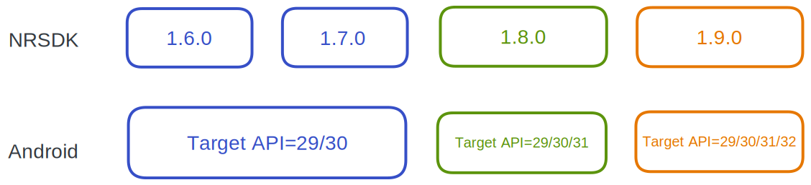
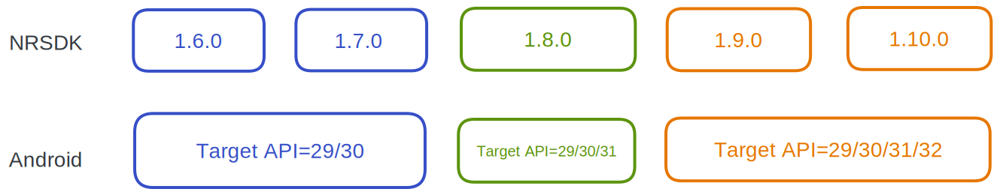
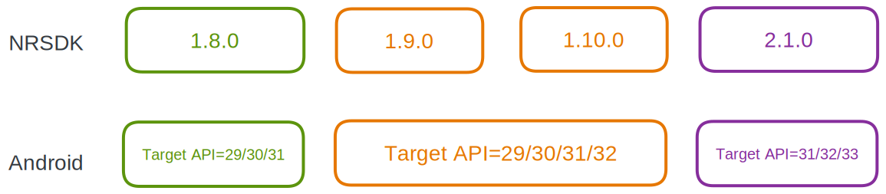
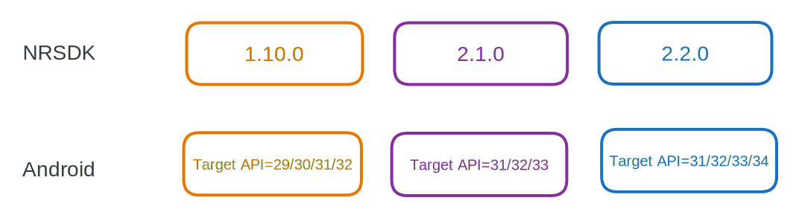

# Compatibility

### Version Compatibility

Please refer to the following diagram for software compatibility among different versions of Nebula, NRSDK, and Android. Any combination along a vertical line (for example, Nebula 2.3.4, NRSDK 1.8.0, Android 12 and below with target API 31) remains a compatible combination.

import Tabs from '@theme/Tabs';
import TabItem from '@theme/TabItem';

<Tabs>

  <TabItem value="Nebula 2.3.4" label="Nebula 2.3.4">
    
  </TabItem>
  <TabItem value="Nebula 3.2.1" label="Nebula 3.2.1">
    
  </TabItem>
  <TabItem value="Nebula 3.5.0" label="Nebula 3.5.0">
    
  </TabItem>
  <TabItem value="Nebula 3.8.0" label="Nebula 3.8.0">
    
  </TabItem>

  <TabItem value="Nebula 3.8.1" label="Nebula 3.8.1 & MyGlasses 1.4.0">

  </TabItem>

</Tabs>

You could find settings for Target API level in **Project Settings -> Player -> Target API Level**.

### Feature Compatibility
#### XREAL Glasses

NRSDK runs on multiple Android devices and different types of XREAL glasses (Air / Light). The following tables list the NRSDK features that are supported by XREAL Light / Air, and the Android phone models that support XREAL Light / Air.

| Features                            | XREAL Light           | XREAL Air/Air 2/Air 2 Pro | XREAL Air 2 Ultra |
| :---------------------------------- | :-------------------- | :------------------------ | :---------------- |
| Head Tracking                       | 6DoF                  | 3DoF                      | 6DoF              |
| Plane Tracking                      | Yes                   | No                        | Yes               |
| Image Tracking                      | Yes                   | No                        | Yes               |
| Hand Tracking                       | Yes                   | No                        | Yes               |
| Depth Mesh                          | Yes                   | No                        | Yes               |
| Spatial anchor                      | Yes                   | No                        | Yes               |
| First Person View | Application & Reality | Application               | Application       |
| Controller                          | 3DoF                  | 3DoF                      | 3DoF              |
| Customize Phone Controller UI       | Yes                   | Yes                       | Yes               |
| Emulator Testing                    | Yes                   | Yes                       | Yes               |
| Notification Popup                  | Yes                   | Yes                       | Yes               |

It is worth noting that **XREAL Air, Air 2, and Air 2 Pro have no camera, hence no tracking features other than rotations**. By default, NRSDK will attempt to run your application with best compatibility if both XREAL[ Light and XREAL Air support is configured](../02_Getting%20Started%20with%20NRSDK.md). Nevertheless, be aware that the actual behavior of the running application may vary in this way and can differ from your initial intent.

If you don’t want NRSDK to automatically adapt for XREAL Air, please specify the supported devices in NRSDK’s global configuration file `NRKernalSessionConfig`. See [Getting Started with NRSDK](../02_Getting%20Started%20with%20NRSDK.md) for more details.

#### Android Phones

To focus on developing better features and ensuring the usability and stability of our glasses, we have released our own XR spatial computing device, **BeamPro.** Starting from NRSDK 2.3.0, we will be reducing the list of supported phone models. Beyond BeamPro, we will only continue to support Samsung flagship models, as detailed in the list below.

Moreover, compatibility with **Light and Air 2 Ultra** also means that features such as hand tracking, plane detection, meshing, image tracking, and spatial anchor will work seamlessly on these phones.

| Brand   | Chip                                   | Model Name         | Model Number | Android Version |
| :------ | :------------------------------------- | :----------------- | :----------- | :-------------- |
| Samsung | Qualcomm Snapdragon 8 Gen 1            | galaxy S22         | SM-S9010     | Android 14      |
| Samsung | Qualcomm Snapdragon 8 Gen 2 （SM8550） | galaxy S23         | SM-S9110     | Android 14      |

--- 
:::danger

Note that Light is not compatible with Samsung galaxy S23.

We have found that the S23 has some issues with URP projects, including abnormal usage of CPU and GPU resources. Please be aware of this when developing your project.

:::

