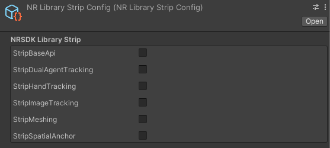

# Getting Started with NRSDK

Start developing your NRSDK Unity apps on Android phone.

This quickstart guide will help you set up your development environment and test out the sample app “Hello MR” using NRSDK.

### 1. Pre-requisites

**Hardware Checklist**

- A supported Android Phone. Please review the[ Device Compatibility](https://xreal.gitbook.io/nrsdk/nrsdk-fundamentals/xreal-devices/compatibility) list to ensure your phone model is compatible with the glasses and NRSDK.

- A pair of **XREAL** glasses.

- **Android Debug Bridge** [(adb)](https://developer.android.com/studio/command-line/adb). Wireless ADB is not required but **strongly recommended**, so that repetitive plug in/out can be avoided.

**Software Checklist**

- [Unity 2019.4.X or later](https://unity3d.com/get-unity/download) with Android Build Support Unity LTS (Long Term Support) version is recommended

- Latest [NRSDK for Unity](https://developer.xreal.com/download)

  The SDK is downloaded as `NRSDKForUnity_x.x.x.unitypackage`

- Android SDK 10.0 (API Level 29) or later, installed using the SDK Manager in [Android Studio](https://developer.android.com/studio)

- [Visual Studio](https://visualstudio.microsoft.com/downloads/) (if you prefer other development environments that’s fine too)

### 2. Creating a Unity Project

We’re going to create a new Unity project and integrate NRSDK later on. To create a new Unity project:

- Open Unity Hub and create a new 3D project.

- Import NRSDK for Unity

  - Select `Assets>Import Package>Custom` Package.

  - Select the `NRSDKForUnity_x.x.x.unitypackage` that you downloaded.

  - In the **Importing** Package dialog, make sure that all package options are selected and click **Import**.

### 3. Configure Project Settings

You could either configure your project automatically via NRSDK **Project Tips** tool or configure manually. These two ways are equivalent.

#### **Project Tips tool**

- Go to NRSDK -> Project Tips in Unity menu

- Click **Accept All** in the popup window

- Wait for Unity to process. The **Project Tips** window should appear as empty when finished.

- Close the Project Tips window

- Most of the settings have been completed here, but `OpenGL ES3` and `Write Permission` still need to be manually configured. Please refer to the manual configuration path below for specific settings.

#### **Manual Configuration**

- Go to **File > Build Settings**.

- Select **Android** and click **Switch Platform**.

- In the **Build Settings** window, click **Player Settings**.

- In the **Inspector** window, configure player settings as follows:

| **Setting**                                                  | **Value**                                                    |
| ------------------------------------------------------------ | ------------------------------------------------------------ |
| `Player Settings > Resolution and Presentation > Default Orientation` | Portrait                                                     |
| `Player Settings > Other Settings > Auto Graphics API`       | false                                                        |
| `Player Settings > Other Settings > Graphics APIs`           | OpenGL ES3                                                   |
| `Player Settings > Other Settings > Package Name`            | Create a unique app ID using a Java package name format. For example, use **com.xreal.helloMR** |
| `Player Settings > Other Settings > Minimum API Level`       | Android 8.0 or higher                                        |
| `Player Settings > Other Settings > Target API Level`        | Automatic (highest installed)                                |
| `Player Settings > Other Settings > Write Permission`        | External(SDCard)                                             |
| `Project Settings > Quality > VSync Count`                   | Don't Sync                                                   |

### 4. Configure Compatible Devices 

You could specify Target Devices in `Assets/NRSDK/NRProjectConfig.` Be aware that **all the NRSDK features supported by XREAL Air are supported by XREAL Light** . By default, both `Support XREAL Light`(VISION) and `Support XREAL Air`(REALITY) are selected.

By selecting VISION, NRSDK will automatically attempt to adapt to XREAL Air, XREAL Air 2 or XREAL Air 2 Pro even if you had implemented NRSDK features that are based on RGB Camera (plane detection, image tracking, hand tracking, recording, etc. See [Device Compatibility](https://xreal.gitbook.io/nrsdk/nrsdk-fundamentals/xreal-devices/compatibility) for details). However, be aware that the actual behavior of the adapted application may differ from your initial intent.

If you only want the application to run on a specific device (Light/Air), you may arbitrarily specify a single target device. In this way, NRSDK will not try to adapt automatically, and the app will not run on unsupported devices.

- support Multi Resume: This feature allows for different displays on the main screen (phone) and the secondary screen (glasses). When the AR app is sent to the background, the glasses continue to display the AR application, while the phone screen can show any 2D app. Essentially, this is dual-screen display functionality. This option is enabled by default, and after adding this feature, it requires permission on the phone upon first use.

### 5. Configure AR Features

- Find and click `Assets/NRSDK/NRKernalSessionConfig` in Unity project folder, make sure the plane tracking, image tracking is configured properly as the following default configuration: 

NRKernalSessionConfig

- Force Kill While Glass Switch Mode: Unselect this option to ensure your app will not be killed when users switch the mode between 2D and 3D mode.

Please note that **Plane Finding Mode** and **Image Tracking Mode** will implicitly be **Disable** when `Support XREAL Air` is selected in **Step 4:  Configure Compatible Devices,** regardless of your configuration here in the inspector.

### 6. Find Hello MR Sample Scene

- Find the **HelloMR** sample scene in the Unity Project window by selecting `Assets > NRSDK > Demos > HelloMR.`

- Double click `HelloMR `to open the scene

### 7. Remove Extra Libraries to Downsize Your APK

Beginning with NRSDK version 2.2.0, we have introduced a new Loader mode. This mode enables the SDK libraries to be loaded from our server, known as Nebula, which can significantly reduce the APK size. However, developers are required to manually deselect any unnecessary libraries. For instance, if your application only requires the meshing feature, you can remove the other libraries by checking them off in the `**NRLibraryStripConfig**`. This action will help to reduce the size of your APK.

### 8. Building NRSDK App for Android
1. Access the **Build Settings** in **Menu -> File ->** **Build Settings**. Click the button "`Add Open Scene`" and make sure the current scene is checked. 

2. Click **Player Settings**. Customize the **Company Name** and **Product Name.** 
3. (Optional) Navigate to the **Android**> **Other Settings** panel to specify your build settings. As you have prepared **Step 3. Configure Project Settings,** you may leave the current configuration as it is. It is worth noting some of the other settings:

- **Multithreaded Rendering**: Enable this option to use multithreaded rendering. In most cases, both enabling and disabling this option is supported by NRSDK. However, for the scenes that contains **Overlay** content, you should disable multithreaded rendering. And When developing URP projects, if [single pass rendering](https://xreal.gitbook.io/nrsdk/development/tools/single-pass-stereo-rendering) is not used, it is best to also turn off Multithreaded rendering, otherwise tearing may occur.

- **Scripting Backend:** You must choose **IL2CPP** when building for ARM64 architecture. Note that starting from NRSDK 2.2, ARMv7 architecture is no longer supported.

4. In **Build Settings** window, click **Build.**
5. Select the destination folder and wait until the building is finished.

### 8. Deploy to XREAL Device

- Connect your Phone / computing unit to your Mac / Windows PC. 

- Install your app through WiFi **Android Debug Bridge** [(adb)](https://developer.android.com/studio/command-line/adb) or type-C cable after the build is successful.

- Disconnect the computing unit with your PC, and then connect it to the glasses.

- (Computing Unit only) If it is the first time you run this app, you need to authorize the app by some tools like [scrcpy](https://github.com/Genymobile/scrcpy).

- Launch your app along with the XREAL Light controller. For instructions on how to use the XREAL Light controller, please refer to [Controller](https://nrealsdkdoc2.readthedocs.io/en/dev/Docs/Unity_EN/Develop/Controller.html#controller-guide).

- Move around until NRSDK finds a horizontal plane and the detected plane will be covered with green grid.

- Click the Trigger button to put an XREAL logo object on it.

- (Optional) Use **Android Logcat** to view logged messages. We recommend using WiFi **Android Debug Bridge** [(adb)](https://developer.android.com/studio/command-line/adb) to connect to your PC so that you do not have to be connected through the data cable most of the time.

- Enable developer options and USB debugging on your Phone / Computing unit. **Android Debug Bridge** [(adb)](https://developer.android.com/studio/command-line/adb) is enabled as default and does not require manual setting.
