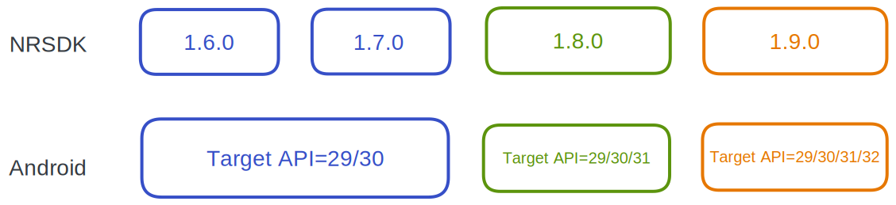
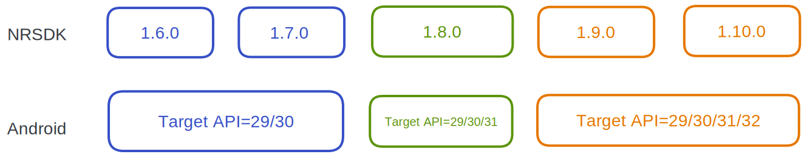
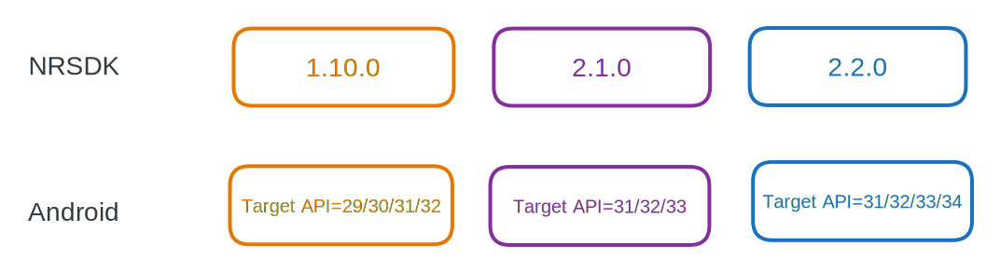

# Compatibility

### Version Compatibility

Please refer to the following diagram for software compatibility among different versions of Nebula, NRSDK, and Android. Any combination along a vertical line (for example, Nebula 2.3.4, NRSDK 1.8.0, Android 12 and below with target API 31) remains a compatible combination.

import Tabs from '@theme/Tabs';
import TabItem from '@theme/TabItem';

<Tabs>

  <TabItem value="Nebula 2.3.4" label="Nebula 2.3.4">
    
  </TabItem>
  <TabItem value="Nebula 3.2.1" label="Nebula 3.2.1">
    
  </TabItem>
  <TabItem value="Nebula 3.5.0" label="Nebula 3.5.0">
    
  </TabItem>

  <TabItem value="Nebula 3.8.0" label="Nebula 3.8.0">
    
  </TabItem>

</Tabs>

You could find settings for Target API level in **Project Settings -> Player -> Target API Level**.

### Feature Compatibility

#### XREAL Glasses

NRSDK runs on multiple Android devices and different types of XREAL glasses (Air / Light). The following tables list the NRSDK features that are supported by XREAL Light / Air, and the Android phone models that support XREAL Light / Air.

| Features                            | XREAL Light           | XREAL Air/Air 2/Air 2 Pro | XREAL Air 2 Ultra |
| :---------------------------------- | :-------------------- | :------------------------ | :---------------- |
| Head Tracking                       | 6DoF                  | 3DoF                      | 6DoF              |
| Plane Tracking                      | Yes                   | No                        | Yes               |
| Image Tracking                      | Yes                   | No                        | Yes               |
| Hand Tracking                       | Yes                   | No                        | Yes               |
| Depth Mesh                          | Yes                   | No                        | Yes               |
| Spatial anchor                      | Yes                   | No                        | Yes               |
| First Person View (with RGB Camera) | Application & Reality | Application               | Application       |
| Controller                          | 3DoF                  | 3DoF                      | 3DoF              |
| Customize Phone Controller UI       | Yes                   | Yes                       | Yes               |
| Emulator Testing                    | Yes                   | Yes                       | Yes               |
| Notification Popup                  | Yes                   | Yes                       | Yes               |

It is worth noting that **XREAL Air, Air 2, and Air 2 Pro have no camera, hence no tracking features other than rotations**. By default, NRSDK will attempt to run your application with best compatibility if both XREAL[ Light and XREAL Air support is configured](https://xreal.gitbook.io/nrsdk/nrsdk-fundamentals/quickstart-for-android#configure-adapted-devices-optional). Nevertheless, be aware that the actual behavior of the running application may vary in this way and can differ from your initial intent.

If you don’t want NRSDK to automatically adapt for XREAL Air, please specify the supported devices in NRSDK’s global configuration file `NRKernalSessionConfig`. See [Getting Started with NRSDK](https://xreal.gitbook.io/nrsdk/nrsdk-fundamentals/quickstart-for-android) for more details.

#### Android Phones

 We are continuously working to ensure that the NRSDK is compatible with every model we have verified, ensuring an optimal user experience. 

Below is a comprehensive list of phone models that are compatible with Nebula and NRSDK. 

Additionally, we have tested these models for compatibility with our four current eyewear models: **Light, Air, Air 2, Air 2 Pro and Air 2 Ultra**, and they are all found to be compatible. 

Moreover, compatibility with **Light and Air 2 Ultra** also means that features such as hand tracking, plane detection, meshing, image tracking, and spatial anchor will work seamlessly on these phones.

| Brand   | Chip                                   | Model Name         | Model Number | Android Version |
| :------ | :------------------------------------- | :----------------- | :----------- | :-------------- |
| HUAWEI  | Kirin 9000 5G (5 nm)                   | huawei mate 40 pro | NOH-AN01     | HarmonyOS 4.0.0 |
| HUAWEI  | Qualcomm Snapdragon 8+ Gen 14G         | huawei P60 Pro     | MNA-ALOO     | HarmonyOS 4.0.0 |
| OPPO    | Qualcomm Snapdragon 8 Gen 2 （SM8550） | oppo find X6 Pro   | PGEM10       | Android 13      |
| vivo    | Qualcomm Snapdragon 8 Gen 2 （SM8550） | vivo X90 Pro+      | V2227A       | Android 13      |
| Samsung | Qualcomm Snapdragon 8 Gen 1            | galaxy S22         | SM-S9010     | Android 13      |
| Samsung | Qualcomm Snapdragon 8 Gen 2 （SM8550） | galaxy S23         | SM-S9110     | Android 13      |
| xiaomi  | Qualcomm Snapdragon 8 Gen 3            | Xiaomi 14          | 23127PNOCC   | Android 14      |
| SONY    | Qualcomm Snapdragon 8 Gen 2 （SM8550） | SONY XRERIA 1V     | A301SO       | Android 13      |
| Honor   | Qualcomm Snapdragon 8 Gen 2 （SM8550） | Honor Magic 5 Pro  | PGT-AN10     | Android 13      |